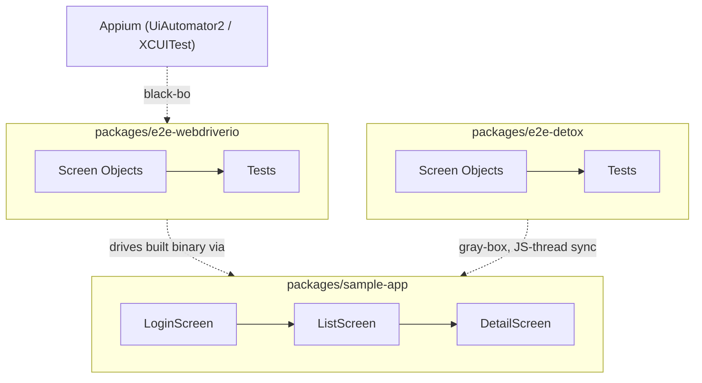

# Mobile Toolkit

[](https://github.com/urielabin/mobile-toolkit/actions/workflows/ci.yml)
[](https://github.com/urielabin/mobile-toolkit/actions/workflows/android.yml)
[](LICENSE)

A React Native monorepo pairing two mobile E2E strategies against the same sample app — WebdriverIO + Appium (black-box) and Detox (gray-box) — plus reusable Fastlane and GitHub Actions CI/CD boilerplate for Android and iOS.

## Packages

| Package | Description |
|---|---|
| [`packages/sample-app`](packages/sample-app) | Bare React Native CLI sample app (login, list, detail) under test |
| [`packages/e2e-webdriverio`](packages/e2e-webdriverio) | Screen Object suite on WebdriverIO + Appium (UiAutomator2 / XCUITest) |
| [`packages/e2e-detox`](packages/e2e-detox) | Screen Object suite on Detox (gray-box, JS-thread synchronized) |

## Architecture



## Stack

| Layer | Technology |
|---|---|
| App | React Native (bare CLI), React Navigation |
| Black-box E2E | WebdriverIO, Appium (UiAutomator2, XCUITest) |
| Gray-box E2E | Detox |
| Unit testing | Jest, React Native Testing Library, Vitest |
| Mobile CI/CD | Fastlane, GitHub Actions |
| Monorepo | npm workspaces, Turborepo |
| Linting | ESLint |

## Design patterns

- **Screen Object** — `BaseScreen` in each E2E package (`e2e-webdriverio`/`e2e-detox`), concrete screens extend it — the mobile equivalent of Page Object Model. The two base classes are deliberately separate, framework-native implementations (WDIO's implicit-global `$`/`browser` vs Detox's `element(by...)` matchers are structurally incompatible) rather than a shared interface pretending they're interchangeable.
- **The login screen's `login()` method is the concrete black-box vs gray-box contrast**: WebdriverIO/Appium explicitly waits out the loading indicator (it has no knowledge of the RN JS thread's timers), while Detox's `tap()` needs no such wait (its gray-box synchronization automatically waits for the JS thread to go idle). Compare `e2e-webdriverio/src/screens/login.screen.ts` and `e2e-detox/src/screens/login.screen.ts` side by side.

## CI/CD

This repo is honest about what actually runs automatically versus what's a starting point to adapt:

| Runs for real in this repo | Boilerplate — copy & complete yourself |
|---|---|
| Lint / typecheck / unit tests (`ci.yml`, every push/PR) | Full emulator + Appium/Detox E2E run (`mobile-e2e.boilerplate.yml`) |
| Android unsigned debug build (`android.yml`, every push/PR) | Signed beta/release Fastlane lanes (need your own signing/API-key credentials) |
| iOS unsigned simulator build (`ios.yml`, manual dispatch) | — |

Fastlane lives inside `packages/sample-app/{android,ios}/fastlane/` — colocated with the native projects it shells out to (`gradlew`, `xcodebuild`), not a separate fake package. Every lane reads project-specific values from `ENV` with this sample app's own values as defaults, so adopting it into your own React Native project means overriding env vars, not forking the file.

## Commands

```bash
npm install

npm test                # all packages, via Turborepo (lint-free, device-free unit tests)
npm run test:sample-app # React Native Testing Library suite only
npm run test:webdriverio # pure support-module unit test only
npm run test:detox      # pure support-module unit test only
npm run lint
npm run typecheck
```

Running the real E2E suites (`npm run test:e2e` in `e2e-webdriverio`/`e2e-detox`) requires a built app binary and a running emulator/simulator — see each package's own README.
